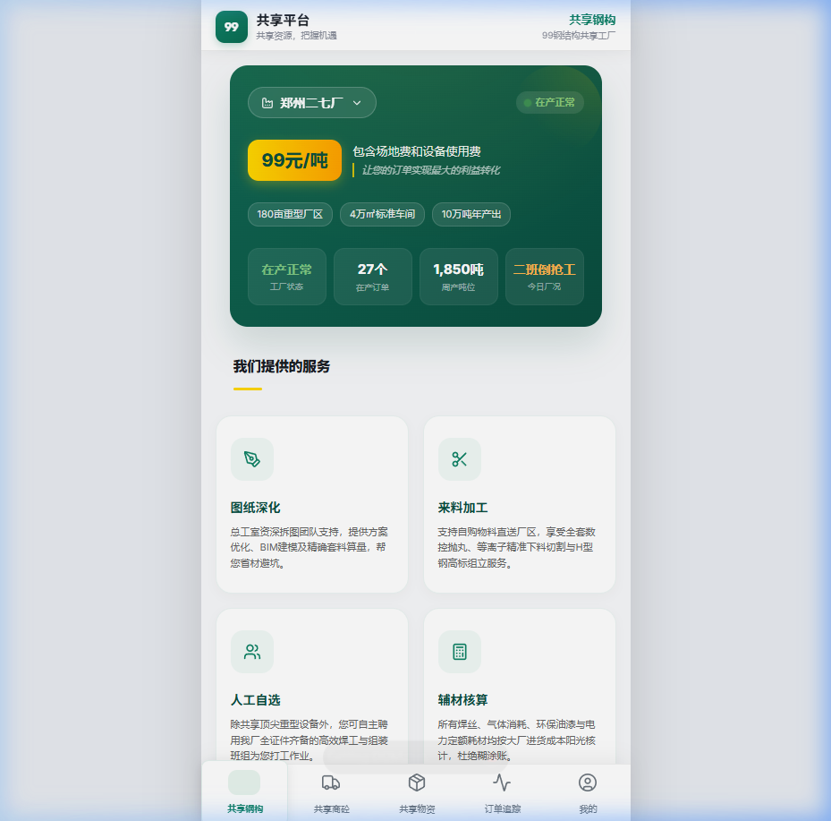
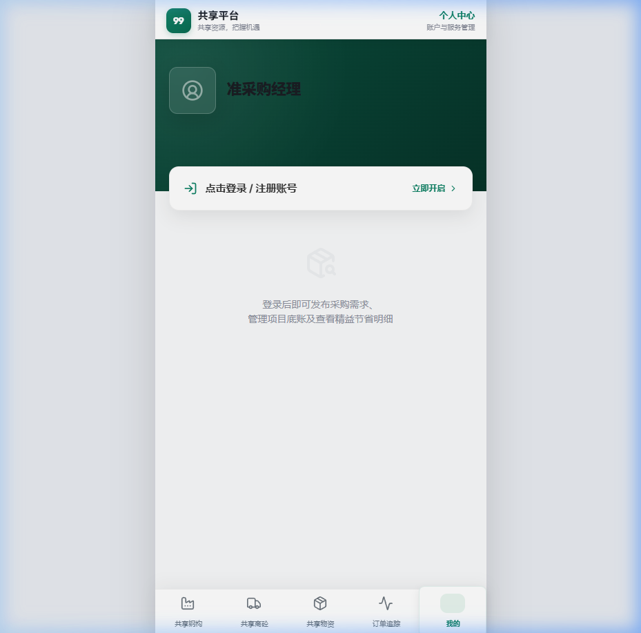

# 99-steel-structure-mp (99共享钢构平台)

🏗️ **99共享钢构平台小程序前端** - 致力于钢结构行业的资源数字化共享与协同制造。

[](LICENSE)
[](https://mp.weixin.qq.com/)
[](https://vitejs.dev/)

## 📝 项目简介 (Project Overview)

**99共享钢构 (99 Shared Steel Structure)** 是一款专为钢结构行业打造的共享工厂协作平台。本项目为该平台的小程序前端部分，旨在通过数字化手段连接工厂闲置产能与客户需求，实现钢构制造的资源优化配置。

该项目包含小程序核心逻辑及高保真 Web 预览原型，重点展示了用户的个人/企业信息、订单统计、资质审核状态以及工厂共享数据的实时监控。

## ✨ 核心功能 (Key Features)

- **📊 智能看板 (Dashboard)**: 实时监控钢构件生产进度与物流信息。
- **🤝 工厂共享 (Shared Factory)**: 闲置产能发布与智能抢单系统。
- **👤 个人中心 (User Profile)**: 数字化身份认证、资质管理及财务账单查询。
- **📱 响应式布局**: 深度适配移动端微信小程序，并提供流畅的工业级交互体验。

## 📸 界面展示 (Screenshots)

| 共享钢构首页 (Home) | 个人中心 (Profile) |
| :---: | :---: |
|  |  |

## 🚀 技术栈 (Tech Stack)

- **Framework**: React 18 + Vite (Web Prototype) / 原生小程序云开发 (Mini Program)
- **UI Architecture**: 设计令牌 (Design Tokens) + 响应式 Flexbox/Grid
- **State Management**: React Hooks / Context API
- **Communication**: Cloud Functions (云函数) / Axios

## 🛠️ 本地开发 (Local Development)

### 1. 克隆仓库
```bash
git clone https://github.com/your-username/99-steel-structure-mp.git
```

### 2. 安装依赖
```bash
cd 99-steel-structure-mp/web-prototype
npm install
```

### 3. 启动开发服务器
```bash
npm run dev
```
启动后，你可以通过浏览器访问 `http://localhost:5173/profile` 查看个人中心预览页，或访问 `http://localhost:5173/steel` 查看主业务看板。

## 📂 目录结构 (Directory Structure)

```text
99gxgg/
├── miniprogram/        # 微信小程序源码
│   ├── pages/          # 业务页面 (钢构、商砼、物资、追踪、我的)
│   ├── components/     # 公用组件
│   └── app.wxss        # 全局设计系统
├── web-prototype/      # 高保真 Web 预览原型
│   ├── src/
│   │   ├── components/ # 核心 UI 组件
│   │   ├── pages/      # 页面视图 (Steel, Profile, etc.)
│   │   └── index.css   # 全局样式令牌
├── assets/             # 项目静态资源 (截图、图标)
├── cloudfunctions/     # 云端业务逻辑
└── project.config.json # 小程序项目配置
```

## 📄 开源协议

本项目采用 [MIT License](LICENSE) 协议开源。
